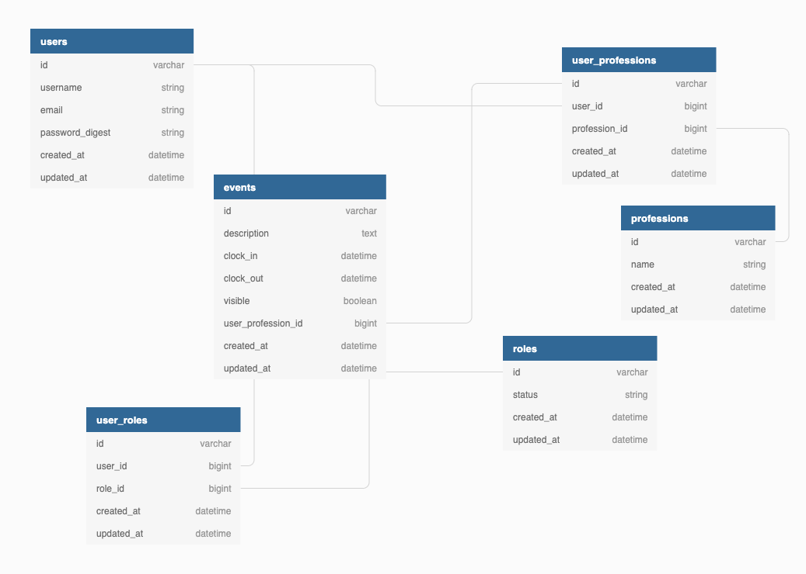

## Coding Challenge Questions and Answers
### Please describe your process for approaching the code challenge. What kind of planning did you do? Did your plans change as you began coding?

I broke the project into small elements
- Database Design
- APIs / Business logic
- Backend Testing
- Frontend Design
- API integration
- Basic Frontend Testing
- Deployment

### Database Design
This a screenshot of the database design


#### Database table
- A user table [email: string, username: string, password: string ]
- A role table [ status: enum(admin, staff) ]
- A user_role join table [user: reference by user_id, role: reference by role_id ]
- A profession table [name: string ]
- A user_profession join table [user: reference by user_id, profession: reference by profession_id]
- An event table [description: text, clock_in: datetime, clock_out: datetime, visible: boolean, user_profession reference by user_profession_id]

#### Model relationships

- A  user has one user_role at the stage of the MVP but the table can accomodate many roles to a user by updating the model relationship.
- A user has one role through user_role
- A user has one user_profession
- A user has one profession( Can be extended to have more profession e.g a user can be both teacher and a baby sitter)
- A user has through user_profession
- A user_role belongs to a user
- A user_role also belongs to a role
- A user_profession belongs to a user
- A user_profession also belongs to a profession
- A user_profession has many events
- A role has one user_role
- A role has one user through user_hole
- A profession has one user_profession
- A profession has one user through user_profession
- An event belongs to a user_profession

### API / Business Logic
Next, was creating the endpoints and writing out business logic. This was done by creating controllers which hooks up to routes.
 
 #### API List
 - Create user (` POST /users`)
   - body params {user: {username: string, email: string, password: string, profession: string, password_confirmation: string } }
 - Create sign_in (`POST /login`)
   - body params { user: { username: username string, password: string} } or { user: { username: email string, password: string } }
 - Get all professions (`GET /professions`)
 - Create a profession (`POST /professions`)
   - body params { profession: { name: string } } 
 - Delete a profession (`DELETE /professions/:id`) 
 - Get user events (`GET /user_events`) 
 - Create a new Entry(`POST /events`)
   - body params { description: string }  
 - Update an existing Entry(`PUT /events/:id`)
   - body params {event: { description: string, clock_in: string, clock_out: string } } 
 - Trash an event (`PUT /events/:id/trash_event`)
 - Clock out (`PUT /event/:id/clock_out`)

 #### Authentication

I decided to use JWT based authentication which involves generating a token that get's return in the frontend, when a user logs in. The token generated comes with a time of expiry which allowed me to calculate and know when the token expires. 

I also created an Error handing service which help to rescue error across the app.

#### Backend Testing
- TDD is an important part of software development process. I used RSpec and faker to test the backend code. And also ensured that each endpoint was tested.

#### Frontend Design
The frontend was built using ReactJS framework and MaterialUI (frontend UI framework ) to speed up the development process.

#### API integration
The API was integrated using Axios on the React View. I created an Axios instance which can be reused for all HTTP requests/actions.

#### Basic Frontend Testing
The frontend was tested using Jest and React Testing Library. It basically involved testing that component renders properly without crashing. This can be expanded into more detailed component testing.

#### Deployment
The app was deployed to Heroku cloud service.


My plans didn't change because I knew exactly what I wanted to achieve. Due to time contraint, I wasn't able to add new features and work thoroughly on existing functionality.


### Describe the schema design you chose. Why did you choose this design? What other alternatives did you consider?

As mentioned earlier in the process pipeline above. This is a db diagram showing the schema design


While thinking about this project, One of the things that came to mind is scalability. 

- How do we scale this?
  - Just like any database-driven application, we need to create a system that is scalable and maintainable. 

- Why did I choose this design?

  - While brainstorming, a couple of considerations came up for instance,  Do we want user to have more than one profession in the future(e.g Teacher, Engineer, BabySitter). Do we want to have more than one role in the future. Do we want a user to log events based of their profession? The idea here is to make the system as robust as possible. An alternative I considered was having 4 tables.

  - role table
  - user table
  - event table
  - profession table
- The model relationship would be;
  - A role has many users
  - A user belong to a role
  - A user has many events
  - An event belong to a user
  - A profession has many users
  - A user belong to a profession.

This is simple but in my opinion does not provide an opportunity for a user to have more than one profession. I also see a scenario where scaling this would be alterations to the database to accommodate big changes.

### If you were given another day to work on this, how would you spend it? What if you were given a month?

#### If give another day, I would focus on handling edge cases. Some of the edge cases not captured in the first iteration includes:

- A user should be only be able to create a new event if the last event has been clocked out. Since it is same user, It is not possible to be in multiple place or doing two things at one. It doesn't give a true sense of the amount of time spent in a day, if a user can clock in more than one concurrent event.
- Write more tests to capture more edge cases. This would also include integration/end-to-end tests.
- Improve the current design.
- Code linting with prettier on the frontend and Robocop at the backend
- Integrate Travis CI for continious integration and deployment.

#### If give a month, I would add some new features, Some of these features includes:
- Building out the admin dashboard, for better tracking and utilizing some of the existing admin endpoints as well as creating new endpoints to support it.
- I might consider removing the edit functionality from the staff user and allowing only admins to edit events. I feel it makes more sense that a staff user should not be able to edit their own entries or entries from other users. Edit request should be forwarded to admin users via mail or in app. The admin user, would review that request and decide to either go forward with the edits based on the reason or decline the edit.
- From within the dashboard, I should see all users events and filter by profession and role.
- I should be able to see all events that has been trashed and from trash, I can permanently delete an event.
- Migrate to GraphQL from Rest. The advantage of this is it prevent "over-fetching" from the server. The client have the ability to dictate exactly what they need from the server and recieve that data in a predictive way. Also an ability to retrieve many resources in a single request.


## Installation

This application is designed to run locally on the Rails development server with a postgreSQL database.


### Prerequisites
Developed and tested with the following components:
- ruby-2.6.3
- rails 6.0.3
- postgreSQL 13.2
- bundler 2.2.15

For help setting up Rails, see https://guides.rubyonrails.org/getting_started.html.

### Application setup

Install the application itself using git:

```
extract the zip file into a directory of choice

```

```
cd clockme
```

Install gems

```
bundle install
```

if you are getting the error 
`Your Ruby version is 2.X.X, but your Gemfile specified 2.X.X`. Try to install the version specified in this
readme
You can use `rvm`. If you don't have rvm, You can install it on your system from the link https://rvm.io/

run `rvm use 2.6.3` on your terminal, next run `gem install bundler`


Install frontend packages

```
yarn install
```


### Database Setup
To setup the database just run the command below to create and migrate the tables

```
rails db:setup
```

Next, seed in test data

```
rails db:seed
```

### Authentication
Authentication was implemented using JSON Web Token(JWT) authentication and encrypt the password in the database.


## Usage
To start the server, run the command

```
rails s
```

Navigate to your browser and enter the url below.

```
http://localhost:3000
```

## Test
To run all tests in the backend use the command below

```
rspec
```

To run a single test e.g event controller request test

```
rspec spec/controllers/events_controller_spec.rb
```

To run all tests in the frontend use the command

```
yarn test
```


## Project Flow

This the flow of the application

- When a user signs up, the user is redirected to the login page to sign in
- We see all the user entries with a button to log a new event
- A user can clock out after a while
- A user can edit their entries.
- An admin can trash an event. Trashing as event simply making it invisible. I strongly believe is keeping a history of events rather than deleting it outright. Events can still be deleted permanently (Although no UI yet)


## Further Enhancements

- handle/catch mismatch routes by creating a nice friendly 404 page.

- Add improvement to the admin page and turn that into fancy dashboard for admins to monitor the progress of teachers.
- UI improvements
- Handle more edge cases.
- Code linting(prettier on the frontend and Robocop at the backend)


